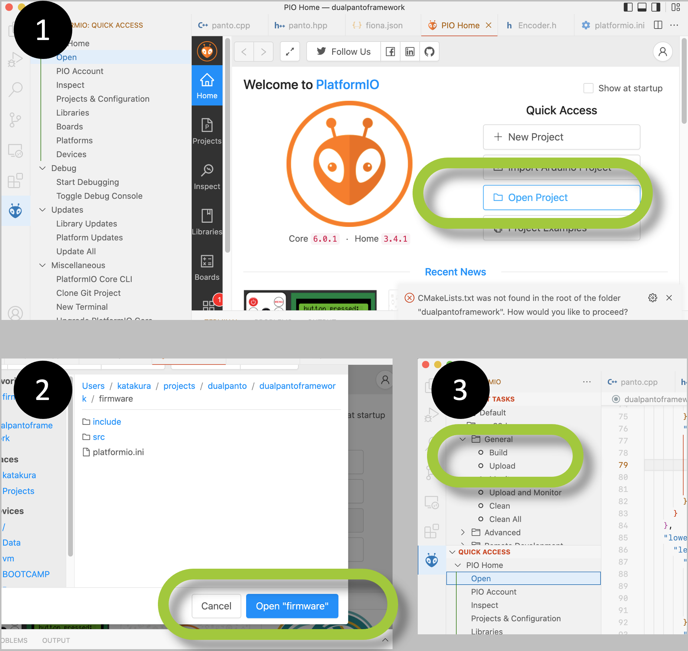
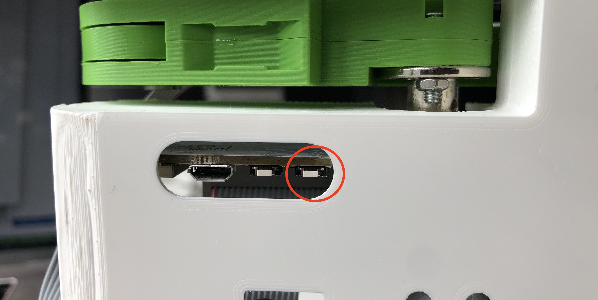

This is the instruction for last half of BIS lecture. If you have any trouble for installation, firmware uploading, and testing dualpanto device, see this documentation first.

If you can not solve it, please describe the trouble to **BIS discord (general channel)**. This is important because most of person tend to get same type of issue. If everyone can share the trouble and solution,  it is fast to solve the trouble you have.

# #0 Pre-Installation
Before uploading dualpantofirmware, please install and setup following things

## Install the ESP32 driver

- [Download](https://www.silabs.com/developers/usb-to-uart-bridge-vcp-drivers?tab=downloads) the installer for your OS-Version.
- Run the installer.

## Setup C++ environment

- Install node (v12.22.1) and npm (v6.14.12)

### macOS
 - Go to Appstore and install Xcode
 - Run `xcode-select –install` to install the compilers
 - Run `sudo xcode-select -s /Applications/Xcode.app/Contents/Developer`

### windows
 - Install Visual Studio 2019 or 2017
 - Select at least the workload “Desktopentwicklung mit C++”

## Install Platformio
Please follow the respective instruction.
- [VS code user](https://docs.platformio.org/en/latest/integration/ide/vscode.html)
- [CLion user](https://www.jetbrains.com/help/clion/platformio.html)

# #1 Firmware Uploading
First, clone dualpantoframework (=firmware + hardware setup)

`git clone git@github.com:HassoPlattnerInstituteHCI/dualpantoframework.git`
- [dualpantoframework](https://github.com/HassoPlattnerInstituteHCI/dualpantoframework) 

## Generate hardware config via npm
go `/dualpantoframework` (_not_ `/dualpantoframework/firmware`) 

then
`npm run script config`

This converts each version's hardware config file written in json into .hpp and .cpp file in firmware.

## Upload Firmware
Please follow the respective instruction.
- [VS code user](https://docs.platformio.org/en/latest/integration/ide/vscode.html)
- [CLion user](https://www.jetbrains.com/help/clion/platformio.html)

This is rough summary for VScode.

please keep pressing the following button when uploading the firmware to dualpanto. (for some pc, it works without pushing the button, but we don't know why).

If you have trouble yet, check [here](https://hpi.de/baudisch/dokuwiki/building-interactive-systems-ss2024/setup/dp-firmware).

more information: [dualpantoframework](https://github.com/HassoPlattnerInstituteHCI/dualpantoframework) 

# #2 Testing Dualpanto (Hardware and Communication)
Once you have (or feel) trouble in dualpanto devices, check hardware, and communication protocol with
[dualpanto-testing](https://github.com/HassoPlattnerInstituteHCI/dualpanto-testing). you can see the documentation at this repo.

# #3 Unity
check [unity-dualpanto-toolkit](https://github.com/HassoPlattnerInstituteHCI/unity-dualpanto-toolkit)

# Troubleshooting

### Q: dualpanto device makes crazy noise. how can I fix it?
please take out battery first, and check all set screws between big 4 motors and linkages.

### Q: ME and (or) IT handle move so slowly.
please check your device with [dualpanto-testing](https://github.com/HassoPlattnerInstituteHCI/dualpanto-testing). maybe motor has problem